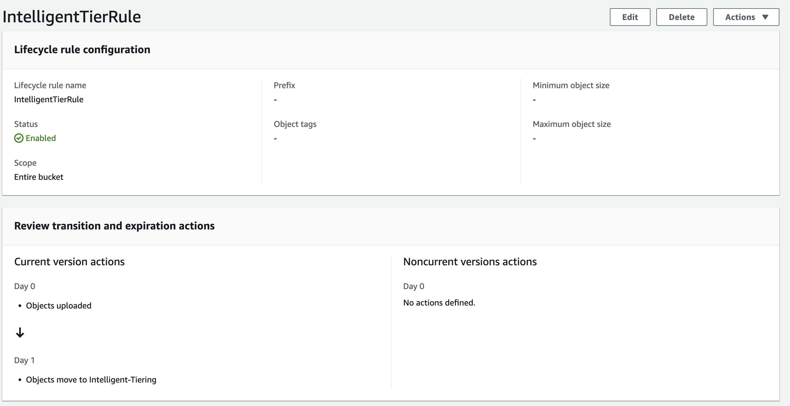

# s3-bucket-intelligence-tiering-compliance
applies intelligent tiering to all s3 buckets in account to save on s3 cost without having to delete objects.

## What is this for ?
Working with legacy s3 buckets with large amounts of data can be tedious, In order to identify resources that are infrequently accessed you can apply intelligent tiering to help locate and save money on stored objects

## How it works
You can run this one time, but recomended to use as a lambda that runs ones a month in each aws account. It will apply the policy after one day and begin the Intelligent tiering process to save money on s3 storage based on accesability.

Once you run it you can check the policy on the bucket and will also return the policy applied in the logs.



```
{
  Rules: [{
      Filter: {
        Prefix: ""
      },
      ID: "IntelligentTierRule",
      Status: "Enabled",
      Transitions: [{
          Days: 32,
          StorageClass: "INTELLIGENT_TIERING"
        }]
    }]
}
```

## Docs
[Intelligent Tiering](https://aws.amazon.com/s3/storage-classes/intelligent-tiering/)
